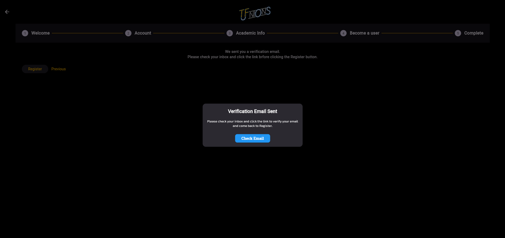
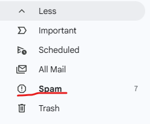
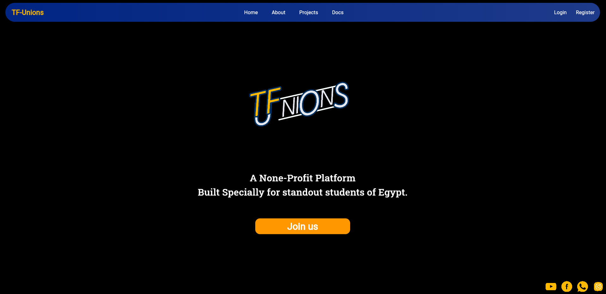
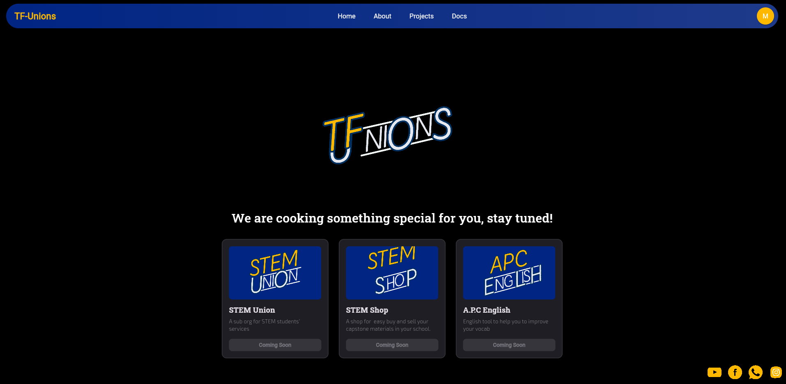
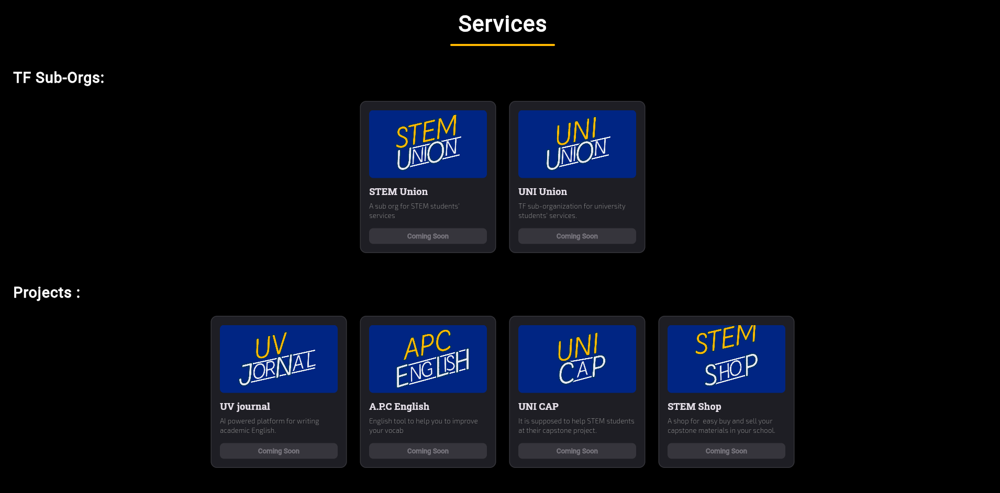

# TF-Unions

This is the official website for TF-Unions platform, it offers creating account by regisster, login, logout, and Delete account. Aslo this is the official place to know about TF-Unions.

This project build using flutter, may be it is strange (why to make a webiste using flutter !!) this is becaseu the my upcoming projets will be on mobile and desktop, So Iam trying to improve coding by flutter.

It is not a static website it is a dynamic, the Used BaaS is Firebase. which used for Authentication and Data storage.

## Getting Started

you can try This project from [here ](https://tf-unions.netlify.app/)
- first you take a look on the website and know more about TF-Unions.
- then you click join us or register button.
- follow the registeration Steps.
- when it sends you a verfication email as this 
- if you didn't find it in your inbox it will be in spam Emails like this 
- congrats you now have an account.
- in the second time you can login there two methods email and password and also signin with google
- if you foget the password you can reset it. smootly with google verifiaction
- now the hero section will change from CTA to your Dashboard as from  to 
- you can click the profile circle to logout or delete your account.
- also you can check the docs for more info about TF-Unions
- the project section is uptodate with the firebase becuase it is conneced to it.

